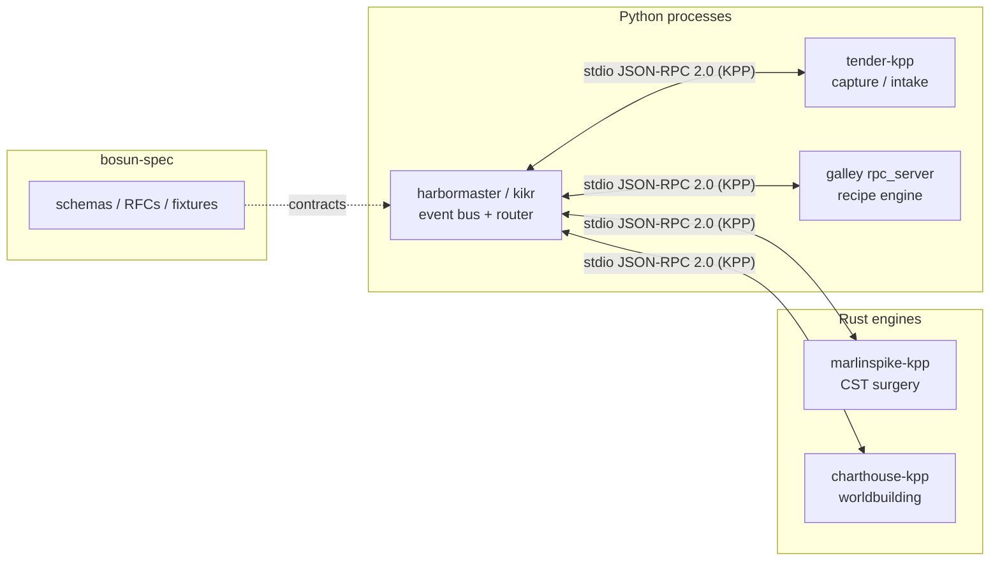

# bosun-spec

[](https://github.com/Bosun-PKM-Tools/bosun-spec/actions/workflows/validate-schemas.yml)

Open specification for Bosun personal knowledge management (PKM): JSON Schema contracts, event vocabulary, JSON-RPC (KPP) method matrix, fixtures, and realm templates.

This repository holds **schemas, RFCs, fixtures, and validation tests**. Runtime engines live in sibling repos.

## Quick Start (5 Minutes)

New to the fleet? Install the local toolchain, index `examples/starter-vault`, and run the first `kikr` queries:

**[User #1 Quick Start](docs/USER_1_QUICKSTART.md)** — `kikr index`, `kikr find tag:onboarding`, `kikr find status:active`, then ingest Inbox with Tender and the sample recipe with Galley (`stax-chef`).

## What this is

Bosun PKM is a local-first knowledge system. Notes stay on disk as Markdown with YAML frontmatter. Indexes and caches are disposable. Tools interoperate by targeting the same contracts instead of a shared database or network API.

`bosun-spec` is the contract surface:

- Canonical note frontmatter (`schemas/canonical-note-contract-v0.1.json`)
- Pipeline event vocabulary (`schemas/event-vocab-v0.1.json`)
- Per-realm v1 schemas under `schemas/v1/`
- Fleet JSON-RPC 2.0 method matrix over **stdio NDJSON** (`schemas/v1/rpc/fleet-matrix.json`) — no sockets

Python package: `bosun-spec` (`pyproject.toml`). Requires Python 3.10+.

## Architecture

Harbormaster routes JSON-RPC 2.0 (KPP) frames over stdin/stdout to native engines. Marlinspike is the Rowan CST surgery engine. Python daemons (harbormaster/kikr, tender, galley) speak the same stdio protocol. Charthouse is the worldbuilding engine plus a local Tauri preview shell — not a hosted dashboard.



## Fleet components

| Repo | Role |
|------|------|
| [harbormaster](https://github.com/Bosun-PKM-Tools/harbormaster) | Event bus, `kikr` CLI, stdio KPP adapters |
| [marlinspike](https://github.com/Bosun-PKM-Tools/marlinspike) | Rowan CST parser and `marlinspike-kpp` |
| [tender](https://github.com/Bosun-PKM-Tools/tender) | Local capture watchers and `tender-kpp` |
| [galley](https://github.com/galley-tools/galley) | Recipe engine and Galley JSON-RPC stdio server |
| [charthouse](https://github.com/Bosun-PKM-Tools/charthouse) | Realm 48 worldbuilding CLI, SQLite index, `charthouse-kpp`, Tauri GUI |

## Specification documents

### Schemas (`schemas/`)

| File | Description |
|---|---|
| [`canonical-note-contract-v0.1.json`](schemas/canonical-note-contract-v0.1.json) | Canonical note frontmatter: required fields, tags, provenance, lineage, relations |
| [`event-vocab-v0.1.json`](schemas/event-vocab-v0.1.json) | Event vocabulary: error/warning codes, severity, payloads |
| [`v1/trice/task.schema.json`](schemas/v1/trice/task.schema.json) | Trice task frontmatter (`pending`/`active`/`done`/`dropped`/`blocked`) |
| [`v1/trice/project.schema.json`](schemas/v1/trice/project.schema.json) | Trice project container |
| [`v1/logbook/journal.schema.json`](schemas/v1/logbook/journal.schema.json) | Daily journal at `locker_logbook/journals/YYYY-MM-DD.md` |
| [`v1/logbook/event.schema.json`](schemas/v1/logbook/event.schema.json) | Synced calendar event record |
| [`v1/yeoman/contact.schema.json`](schemas/v1/yeoman/contact.schema.json) | Contact dossier |
| [`v1/yeoman/interaction.schema.json`](schemas/v1/yeoman/interaction.schema.json) | Interaction note; `$pkm.relations` must include a `type: contact` UUID |
| [`v1/commonplace/work.schema.json`](schemas/v1/commonplace/work.schema.json) | Media work with multi-service `external_ids` |
| [`v1/relations/relations.schema.json`](schemas/v1/relations/relations.schema.json) | Typed `$pkm.relations` predicates and URN targets |
| [`v1/query/graph-dsl.schema.json`](schemas/v1/query/graph-dsl.schema.json) | Vault graph query DSL |
| [`v1/query/federated-query-plan.schema.json`](schemas/v1/query/federated-query-plan.schema.json) | Multi-vault federated query plan |
| [`v1/rpc/fleet-matrix.json`](schemas/v1/rpc/fleet-matrix.json) | JSON-RPC 2.0 fleet method matrix over stdio NDJSON |
| [`v1/rpc/error-envelope.schema.json`](schemas/v1/rpc/error-envelope.schema.json) | JSON-RPC error envelope (`-32000` schema, `-32001` lock, `-32002` orphan URN) |
| [`v1/rpc/event-payloads.schema.json`](schemas/v1/rpc/event-payloads.schema.json) | Notifications and per-realm event payload `$defs` |
| [`v1/telemetry/parquet-contracts.schema.json`](schemas/v1/telemetry/parquet-contracts.schema.json) | Dual-track telemetry Parquet table contracts |

Canonical `$id` URIs are `https://bosunpkm.com/schemas/<path-from-schemas/>`.

### Fixtures (`fixtures/`)

Golden CommonMark examples with YAML frontmatter:

| File | Description |
|---|---|
| [`trice/sample-task.md`](fixtures/trice/sample-task.md) | `$trice:task/v1` with all five task-line markers |
| [`logbook/2026-09-16.md`](fixtures/logbook/2026-09-16.md) | Daily journal with agenda transclusion |
| [`yeoman/jane-doe.md`](fixtures/yeoman/jane-doe.md) | Contact dossier |
| [`commonplace/dune.md`](fixtures/commonplace/dune.md) | Media record |
| [`relations/task-delegated.md`](fixtures/relations/task-delegated.md) | Task assigned to a Yeoman contact URN |
| [`relations/event-attended.md`](fixtures/relations/event-attended.md) | Meeting note linked to a Logbook event URN |

Graph Query DSL fixtures live under [`tests/fixtures/queries/`](tests/fixtures/queries/). Codec samples (vCard, iCalendar, Todoist, Things, Goodreads, Kindle clippings) live under [`fixtures/codecs/`](fixtures/codecs/). Integrity checks are in [`tests/test_codec_fixtures.py`](tests/test_codec_fixtures.py).

### Starter templates (`templates/realms/`)

Obsidian/Markdown templates for all 50 realms (`templates/realms/<realm>.template.md`). Substitution variables: `{{ uuidv7 }}`, `{{ date_utc }}`, `{{ title }}`.

### Reference docs (`docs/`)

| File | Description |
|---|---|
| [`USER_1_QUICKSTART.md`](docs/USER_1_QUICKSTART.md) | 5-minute onboarding: starter vault index, `kikr find`, Tender + Galley ingest |
| [`event-vocab-v0.md`](docs/event-vocab-v0.md) | Human-readable event catalog |
| [`harbormaster-protocol-v1-rfc.md`](docs/harbormaster-protocol-v1-rfc.md) | Read-only loopback HTTP RFC draft (separate from stdio KPP) |

## Core contracts

Every note is a `CanonicalNote` with YAML frontmatter matching [`canonical-note-contract-v0.1.json`](schemas/canonical-note-contract-v0.1.json). Required fields include `schema_version`, `type`, `title`, `status`, `source`, `source_id`, `created_at`, `updated_at`, `tags`, `canonical_format`, `content_format`, and `target_app`.

Pipeline events use four severities: `fatal`, `error`, `warn`, `info`. Envelope shape:

```json
{
  "event": "warn.timestamp.unparseable",
  "severity": "warn",
  "timestamp": "2026-09-03T18:00:00Z",
  "payload": {
    "title": "Meeting Notes",
    "field": "created",
    "raw_value": "yesterday-ish"
  }
}
```

## Quickstart

```bash
pip install ".[dev]"
python -m pytest tests/ -v
```

Standalone scripts (same suite):

```bash
python tests/test_schemas.py
python tests/test_codec_fixtures.py
python tests/test_relations_spec.py
python tests/test_rpc_schemas.py
python tests/test_graph_dsl_schema.py
python tests/test_graph_dsl_fixtures.py
python tests/test_advanced_graph_queries.py
python tests/test_federated_query_fixtures.py
python tests/test_synthetic_vault_graph_execution.py
python tests/test_synthetic_vault_telemetry.py
```

CI workflow: [`.github/workflows/validate-schemas.yml`](.github/workflows/validate-schemas.yml) (Python 3.10, 3.11, 3.12).

## Versioning

Schemas use `v0.1`, `v0.2`, … Breaking required-field changes increment the major version. Additive optional fields are backward-compatible.

## License

Dual-licensed **MIT OR Apache-2.0**. See [LICENSE](LICENSE), [LICENSE-MIT](LICENSE-MIT), and [LICENSE-APACHE](LICENSE-APACHE).

How to contribute: [CONTRIBUTING.md](CONTRIBUTING.md).
