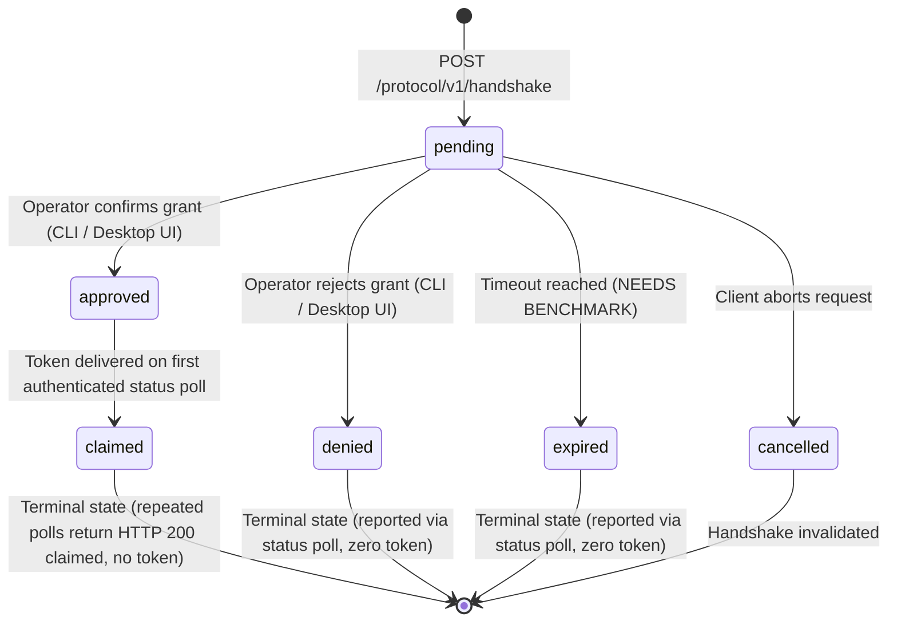

# Harbormaster Protocol v1 Specification (Draft — Revision C)

- **Document Version**: `v1.3.0-draft`
- **Status**: Draft for Operator Review (Non-canonical; design draft only; no implementation authorized)
- **Target Repository**: `Bosun-PKM-Tools/harbormaster` (`apps/harbormaster`)
- **Protocol Scope**: Read-only loopback HTTP API for local module integration
- **Date**: 2026-09-08

---

## 1. Architectural Scope & Boundary

### 1.1 What Harbormaster Is
Harbormaster is the sovereign local-first API and protocol integration layer connecting independently running native modules (such as local desktop clients, CLI utilities, status bar extensions, and read-only inspection tools) to the Harbor knowledge engine. It provides:
1. Cryptographic module identification and capability negotiation;
2. Strict user-approved, capability-gated read access;
3. Machine-readable health diagnostics and adapter registry introspection;
4. Bounded event polling and real-time event streaming over loopback HTTP.

### 1.2 What Harbormaster Is NOT (Explicit Non-Goals & Strict Read-Only Boundary)
To prevent architectural drift, unauthorized privilege escalation, and security vulnerabilities identified in prior assessments (`hub-report-00004.md`, `hub-report-00006.md`, `hub-report-00007.md`), the following constraints are **permanently enforced by design**:
- **Strictly Read-Only Protocol**: Protocol v1 is strictly read-only. **No HTTP endpoint may create, modify, or delete notes, files, engine state, grants, tokens, or other durable state.**
- **No In-Band Token Revocation or Grant Mutation**: Revocation occurs exclusively out-of-band via a local operator CLI (`harbormaster auth revoke`) or a trusted desktop consent surface outside Protocol v1. The protocol provides **no endpoint to approve, deny, modify, or revoke tokens or grants**.
- **NOT a Process Supervisor**: Harbormaster does not start, stop, daemonize, restart, or supervise external module processes. It maintains no process trees, PID files, or lifecycle watchdogs.
- **NOT a Mutation or Ingestion API in v1**: Note conversion and archive ingestion are executed strictly via local CLI invocation (`harbormaster engine run`) or internal in-memory pipelines, never over network listeners in Protocol v1.
- **NOT a Remote, Cloud, or Multi-Tenant Service**: Harbormaster never binds to wildcard `0.0.0.0`, never listens on public interfaces, rejects IPv6, rejects hostnames (including `localhost`), and contains zero remote multi-tenant features.
- **NOT a Publishing System**: Harbormaster does not publish notes to remote servers, blogs, or cloud repositories.

### 1.3 Implementation Gate
Protocol implementation code **cannot begin** until all three of the following conditions are satisfied:
1. Explicit owner approval of this revised specification (`v1.3.0-draft`);
2. Merged standalone schema PR for approved protocol audit events in `docs/schema/event-vocab-v0.1.json`;
3. A formal benchmark/decision record resolving all provisional limits marked `NEEDS BENCHMARK/DECISION`.

---

## 2. Threat Model for Untrusted Local Processes

### 2.1 Adversary Assumptions
In a personal desktop or developer workstation environment, multiple third-party tools, scripts, and background utilities run concurrently under the same operating system user account. The threat model assumes:
1. **Malicious or Compromised Local Native Processes**: An untrusted script, background utility, or rogue local process scans local ports, attempts to connect to `127.0.0.1:8765`, and tries to extract personal knowledge vault metadata or snoop on engine activity.
2. **Local Privilege Escalation & Impersonation**: A process claims an existing client identifier (`client_id`) in an attempt to reuse an existing grant or access restricted engine capabilities.
3. **Slow-Client & Resource Exhaustion (DoS)**: A poorly implemented or adversarial local client opens connections, sends partial headers, or consumes event streams at a crawl to exhaust server memory, thread pools, or socket descriptors.
4. **Token Theft via Environment or Process Snooping**: An untrusted process inspects the command-line arguments, environment variables, or log files of running processes to harvest credentials.
5. **Status Oracle Probing**: An unauthenticated process attempts to guess or brute-force pending handshake poll IDs to monitor operator approval activity.

### 2.2 Defensive Architecture & Invariants
| Threat Vector | Defensive Invariant |
| :--- | :--- |
| **Wildcard / Public Exposure / IPv6 Ambiguity** | **Hard Socket-Level Restriction to Literal IPv4 `127.0.0.1`**: The HTTP listener binds exclusively to literal IPv4 `127.0.0.1`. Binding to `0.0.0.0`, `::`, `::1`, `localhost`, or any external IP raises an immediate fatal initialization error (`ERR_NON_LOOPBACK_PROHIBITED`). |
| **Identity Spoofing** | **Cryptographic Public Key Verification**: Module identity is established exclusively by a registered cryptographic public key (Ed25519). Display strings (`client_id`) carry zero authority. |
| **Host Header Ambiguity / DNS Rebinding Defense** | **Literal IPv4 Host Header Validation**: All incoming requests must provide a `Host` header strictly matching literal `127.0.0.1:<port>`. Requests with `Host: localhost`, `Host: [::1]`, missing, or external host headers are rejected with HTTP 403 (`ERR_FORBIDDEN_HOST`). |
| **Unauthenticated Data Snooping** | **Mandatory Bearer Token**: All protected endpoints require a capability-scoped Bearer token validated in constant time (`hmac.compare_digest`). (Minimal unauthenticated liveness `GET /protocol/v1/health?liveness=true` returns only a basic status string). |
| **Status Oracle Attacks** | **Authenticated Handshake Polling**: `GET /protocol/v1/handshake/status` requires cryptographic request signing matching the original module public key. It is not an unauthenticated status oracle. |
| **Silent Privilege Escalation** | **Deny-by-Default Capability Grants**: Capabilities are never granted implicitly. Every capability must be individually reviewed and approved by the local operator through a trusted consent surface. |
| **Memory / Buffer Exhaustion** | **Drop-on-Lag Ring Buffers**: Real-time event streams maintain bounded ring buffers. Clients that lag behind are disconnected with `ERR_STREAM_LAG` rather than allowing unbounded server memory growth. |

### 2.3 Browser Policy: Browser Clients Out of Scope
**Browser clients are strictly out of scope for Protocol v1.** 
- Protocol v1 is designed exclusively for local native modules.
- Browser-based clients, Cross-Origin Resource Sharing (CORS) headers, and browser session handling are explicitly not supported.
- `Host` header validation against literal `127.0.0.1` is retained strictly as defense-in-depth against malicious local TCP clients attempting Host forgery, not as browser authorization.

---

## 3. Module Identity, Capability Grants & Locker Scoping

### 3.1 Cryptographic Module Identity
- **Public Key Requirement**: Every module connecting to Harbormaster must possess a unique cryptographic keypair (Ed25519).
- **`client_id` is Display Metadata Only**: The `client_id` string (e.g. `"bosun-menu-bar"`) is purely human-readable display metadata for approval prompts and logs. It provides **zero authentication or authorization value**.
- **Cryptographic Binding**: All grants and issued session tokens are cryptographically bound to the tuple:
  `module_binding = (module_public_key, specific_locker_id, approved_capability_set)`.

### 3.2 Capability Grants (Deny by Default)
Permissions are strictly deny-by-default and granular:
- `cap:health:read`: Read detailed engine subsystem diagnostics, readiness, and uptime.
- `cap:adapters:read`: Read registered source adapter metadata and supported formats.
- `cap:events:poll`: Poll the durable event ledger with cursor pagination.
- `cap:events:stream`: Open a real-time Server-Sent Events (SSE) stream.
- `cap:vault:metadata:read`: Query aggregate note counts, schema version, and sync status (strictly non-content metadata).

**No Implicit Permissions**: There are no default permissions. Requesting a token with zero approved capabilities yields a token that cannot access any protected endpoint.

### 3.3 Approval UX & Handshake Lifecycle
Automatic grant approval is strictly forbidden. The requesting module must never be able to approve its own grant.

#### Handshake State Machine
A handshake progresses through six explicit states:
1. `pending`: The client has submitted a signed handshake with its public key and requested capabilities. Awaiting local operator action.
2. `approved`: The local operator explicitly approved the request via a trusted surface. The session token is available for one-time delivery.
3. `claimed`: Terminal state reached immediately after the one-time session token is delivered to the authenticated client via `GET /protocol/v1/handshake/status`. Repeated authenticated polls return HTTP 200 with `handshake_state: "claimed"`, zero plaintext token, zero state mutation, and zero capability expansion, while remaining cryptographically bound to the original module public key, Locker, and handshake identity.
4. `denied`: The operator explicitly rejected the request. Terminal state; no token is issued.
5. `expired`: The operator did not act within the approval timeout window (or the poll expired before operator action). Terminal state; handshake is invalidated.
6. `cancelled`: The requesting client disconnected or cancelled the request before operator action. Terminal state.



#### Supported Approval Surfaces
To approve a `pending` grant, the operator uses one of two trusted local surfaces outside the HTTP protocol:
1. **Foreground Local CLI**: When a handshake is initiated, if Harbormaster is running in an interactive terminal, it presents a clear prompt displaying the client's `client_id`, public key fingerprint, target Locker, and each requested capability individually:
   ```text
   [Harbormaster Auth Request]
   Client ID:    bosun-menu-bar
   Key Hash:     SHA256:7f8a9b...
   Target Vault: primary-vault
   Requested Capabilities:
     [ ] cap:health:read
     [ ] cap:events:poll
   Approve this module? [y/N]:
   ```
2. **Trusted Local Desktop Consent UI**: A native, local OS dialog (e.g. system notification or tray prompt) executing in the operator's desktop session.

### 3.4 Key Lifecycle & Edge Case Handling
- **First Registration**: On initial handshake from an unknown public key, the handshake enters `pending` state. The operator is shown the full public key fingerprint and must explicitly register the key.
- **Unknown Public Keys**: Handshakes from unregistered public keys are never silently accepted; they require explicit operator registration.
- **Key Rotation**: If a module generates a new keypair, it is treated as a new, distinct identity. It cannot inherit grants from a prior key. The operator must approve the new key.
- **Duplicate Client IDs**: If two distinct modules present identical `client_id` strings, the system distinguishes them by their public key fingerprints. Both are displayed to the operator. Existing grants are never shared between different keys.
- **Mismatched Identity Claims**: If a handshake signature fails verification against the provided public key, the request is immediately rejected with `ERR_IDENTITY_MISMATCH`.

### 3.5 Token Lifecycle & Locker Storage
- **Short-Lived Session Tokens**: Tokens are ephemeral session credentials (`hm_pat_<32_bytes_base64url>`).
- **Provisional TTL**: Default token TTL is provisional (`NEEDS BENCHMARK/DECISION`, e.g. 1 hour to 24 hours).
- **No Refresh Endpoint in v1**: When a session token expires, the client must initiate a new `POST /protocol/v1/handshake`. If an approved grant record remains active in the local Locker, the handshake can be re-issued without re-prompting the operator, provided the cryptographic signature verifies.
- **Secure In-Memory Delivery**: The token is delivered strictly in-memory via the JSON response body of the loopback HTTP handshake or authenticated handshake status poll. Tokens are never passed via CLI arguments, environment variables, query parameters, URLs, or world-readable files.
- **Locker Hash Storage Only**: The local Locker (`state/locker/grants.json`) stores only salted SHA-256 hashes of issued tokens, never plaintext tokens. File access is restricted to the process owner (`0600` on POSIX, Owner-only DACL on Windows).
- **Out-of-Band Revocation**: Revocation is performed strictly outside Protocol v1:
  ```bash
  harbormaster auth revoke --key-fingerprint <fingerprint> --locker <id>
  ```

---

## 4. Endpoint Specifications & JSON Contracts

All responses adhere to the standard JSON envelope:
```json
{
  "status": "success",
  "data": { ... },
  "metadata": {
    "timestamp": "2026-09-08T16:00:00Z",
    "request_id": "req-01JC8B01"
  }
}
```

### 4.1 `POST /protocol/v1/handshake`
Initiates version negotiation, proves module identity, and requests session authorization.

- **Authentication**: Cryptographic signature over handshake payload using the module's private key.
- **Headers**:
  - `Host: 127.0.0.1:<port>` (mandatory; literal IPv4 only)
  - `Content-Type: application/json`
- **Request Body**:
```json
{
  "protocol_version": "1.0",
  "client_id": "bosun-menu-bar",
  "client_version": "0.2.0",
  "module_public_key": "ed25519:7f8a9b1c2d3e4f5a6b7c8d9e0f1a2b3c4d5e6f7a8b9c0d1e2f3a4b5c6d7e8f9a",
  "locker_id": "primary-vault",
  "timestamp": "2026-09-08T16:00:00Z",
  "nonce": "n-01JC8B01A",
  "signature": "base64_signature_over_canonical_payload",
  "capabilities_requested": [
    "cap:health:read",
    "cap:events:poll"
  ]
}
```
- **Response (HTTP 200 OK — If pre-approved grant exists)**:
```json
{
  "status": "success",
  "data": {
    "handshake_state": "approved",
    "protocol_version": "1.0",
    "token": "hm_pat_a8f9c2d1e0b4457890abcdef12345678",
    "token_type": "Bearer",
    "expires_at": "2026-09-09T16:00:00Z",
    "locker_id": "primary-vault",
    "capabilities_granted": [
      "cap:health:read",
      "cap:events:poll"
    ],
    "server_info": {
      "name": "harbormaster",
      "version": "0.1.0"
    }
  },
  "metadata": {
    "timestamp": "2026-09-08T16:00:00Z",
    "request_id": "req-01JC8B02"
  }
}
```
- **Response (HTTP 202 Accepted — If pending operator approval)**:
```json
{
  "status": "success",
  "data": {
    "handshake_state": "pending",
    "message": "Handshake requires operator approval on local CLI or desktop consent UI.",
    "approval_poll_id": "poll-01JC8B03-7f8a9b1c",
    "expires_at": "2026-09-08T16:02:00Z"
  },
  "metadata": {
    "timestamp": "2026-09-08T16:00:00Z",
    "request_id": "req-01JC8B03"
  }
}
```
- **Error Codes**:
  - `ERR_VERSION_MISMATCH` (HTTP 400): Protocol version unsupported.
  - `ERR_IDENTITY_MISMATCH` (HTTP 401): Cryptographic signature verification failed.
  - `ERR_FORBIDDEN_HOST` (HTTP 403): `Host` header is not literal `127.0.0.1:<port>`.
  - `ERR_CAPABILITY_DENIED` (HTTP 403): Operator denied requested capabilities.
  - `ERR_HANDSHAKE_EXPIRED` (HTTP 408): Approval prompt timed out.

---

### 4.2 `GET /protocol/v1/handshake/status`
Read-only polling endpoint to check the state of a pending handshake and retrieve the session token once approved by the operator.

- **Authentication & Anti-Oracle Protection**:
  To prevent this endpoint from becoming an unauthenticated status oracle (which would allow unauthorized local processes to snoop on pending approvals), **the status poll request must be cryptographically authenticated**:
  - `Host: 127.0.0.1:<port>` (mandatory; literal IPv4 only)
  - `X-Module-Public-Key`: `<module_public_key>`
  - `X-Poll-Timestamp`: UTC ISO-8601 timestamp (within fresh clock drift window, e.g. 30s)
  - `X-Poll-Nonce`: Unique per-poll random nonce
  - `X-Handshake-Signature`: Base64 cryptographic signature over:
    `"GET /protocol/v1/handshake/status:" + approval_poll_id + ":" + X-Poll-Timestamp + ":" + X-Poll-Nonce`
- **Query Parameters**:
  - `approval_poll_id` (string, mandatory): The opaque poll identifier returned in the HTTP 202 handshake response.
- **Server Verification Invariants**:
  1. The server verifies `X-Handshake-Signature` using `X-Module-Public-Key`.
  2. The server verifies that `X-Module-Public-Key` matches the public key bound to `approval_poll_id`.
  3. The server checks timestamp freshness and nonce replay.
  4. If the public key does not match: HTTP 403 `ERR_IDENTITY_MISMATCH`.
  5. If the poll ID is unknown, never issued, malformed, cross-scope, or expired and purged: HTTP 404 `ERR_HANDSHAKE_UNKNOWN`. (Already-delivered polls transition to terminal state `claimed` and return HTTP 200).
  6. If a cross-Locker access is attempted: HTTP 403 `ERR_LOCKER_MISMATCH`.
- **Response (HTTP 200 OK — While Pending)**:
  *Note: The session token is NEVER returned while the handshake is pending.*
```json
{
  "status": "success",
  "data": {
    "handshake_state": "pending",
    "approval_poll_id": "poll-01JC8B03-7f8a9b1c",
    "expires_at": "2026-09-08T16:02:00Z",
    "retry_after_seconds": 2
  },
  "metadata": {
    "timestamp": "2026-09-08T16:00:10Z",
    "request_id": "req-01JC8B04A"
  }
}
```
- **Response (HTTP 200 OK — Approved / One-Time Token Delivery)**:
  *Upon operator approval, the session token is released strictly once on the first authenticated status poll. Immediately after delivery, the poll record transitions to terminal state 'claimed'.*
```json
{
  "status": "success",
  "data": {
    "handshake_state": "approved",
    "token": "hm_pat_a8f9c2d1e0b4457890abcdef12345678",
    "token_type": "Bearer",
    "expires_at": "2026-09-09T16:00:00Z",
    "locker_id": "primary-vault",
    "capabilities_granted": [
      "cap:health:read",
      "cap:events:poll"
    ]
  },
  "metadata": {
    "timestamp": "2026-09-08T16:00:25Z",
    "request_id": "req-01JC8B04B"
  }
}
```
- **Response (HTTP 200 OK — Claimed / Repeated Poll After Token Delivery)**:
  *Repeated authenticated polls for an already-claimed poll ID return HTTP 200 with state 'claimed'. No plaintext token is returned, no capabilities are expanded, and no state is mutated. The poll remains cryptographically bound to the original module public key and Locker.*
```json
{
  "status": "success",
  "data": {
    "handshake_state": "claimed",
    "approval_poll_id": "poll-01JC8B03-7f8a9b1c",
    "message": "Token has already been delivered for this approved handshake. Plaintext token is no longer available.",
    "locker_id": "primary-vault",
    "capabilities_granted": [
      "cap:health:read",
      "cap:events:poll"
    ],
    "expires_at": "2026-09-09T16:00:00Z"
  },
  "metadata": {
    "timestamp": "2026-09-08T16:00:40Z",
    "request_id": "req-01JC8B04D"
  }
}
```
- **Response (HTTP 200 OK — Denied / Expired / Cancelled)**:
```json
{
  "status": "success",
  "data": {
    "handshake_state": "denied",
    "reason": "Operator denied capability request.",
    "approval_poll_id": "poll-01JC8B03-7f8a9b1c"
  },
  "metadata": {
    "timestamp": "2026-09-08T16:00:30Z",
    "request_id": "req-01JC8B04C"
  }
}
```
- **Read-Only Invariant**: This endpoint **cannot approve, deny, or alter grants**. It merely reports the status of a signed request managed by the local operator UI/CLI.

---

### 4.3 `GET /protocol/v1/health`
Inspects runtime availability, subsystem readiness, and liveness.

- **Authentication**:
  - Unauthenticated minimal probe: Allowed only with query parameter `?liveness=true`. Returns strictly `{ "status": "healthy" }`.
  - Full diagnostic probe: Requires Bearer token with `cap:health:read`.
- **Headers**:
  - `Host: 127.0.0.1:<port>` (mandatory; literal IPv4 only)
- **Response (HTTP 200 OK — Full Diagnostic)**:
```json
{
  "status": "success",
  "data": {
    "service": "harbormaster",
    "status": "operational",
    "version": "0.1.0",
    "uptime_seconds": 3612.4,
    "subsystems": {
      "engine": {
        "status": "ready",
        "supported_formats": ["enex", "notion"]
      },
      "event_ledger": {
        "status": "active",
        "total_events": 128
      }
    }
  },
  "metadata": {
    "timestamp": "2026-09-08T16:00:00Z",
    "request_id": "req-01JC8B05"
  }
}
```

---

### 4.4 `GET /protocol/v1/adapters`
Returns the inventory of active format adapters and support parameters.

- **Authentication**: Bearer token with `cap:adapters:read`.
- **Headers**:
  - `Host: 127.0.0.1:<port>` (mandatory; literal IPv4 only)
- **Response (HTTP 200 OK)**:
```json
{
  "status": "success",
  "data": {
    "adapters": [
      {
        "format": "enex",
        "class_name": "EnexAdapter",
        "extensions": [".enex"],
        "supports_directory": false,
        "supports_zip": false,
        "status": "active"
      },
      {
        "format": "notion",
        "class_name": "NotionAdapter",
        "extensions": [".zip", ".html"],
        "supports_directory": true,
        "supports_zip": true,
        "status": "active"
      }
    ]
  },
  "metadata": {
    "timestamp": "2026-09-08T16:00:00Z",
    "request_id": "req-01JC8B06"
  }
}
```

---

### 4.5 `GET /protocol/v1/events/poll`
Bounded query for engine and lifecycle events using resumable cursor pagination.

- **Authentication**: Bearer token with `cap:events:poll`.
- **Headers**:
  - `Host: 127.0.0.1:<port>` (mandatory; literal IPv4 only)
- **Query Parameters**:
  - `after_cursor` (string, optional): Opaque cursor representing the last seen event sequence ID.
  - `limit` (integer, optional): Maximum events to return (provisional limit: default `50`, max `200` — `NEEDS BENCHMARK/DECISION`).
  - `filter_type` (string, optional): Event prefix filter (e.g. `info.engine`, `err.stage`).
- **Response (HTTP 200 OK)**:
```json
{
  "status": "success",
  "data": {
    "events": [
      {
        "seq_id": 1042,
        "timestamp": "2026-09-08T15:50:12Z",
        "code": "INFO_ENGINE_RUN_STARTED",
        "event": "info.engine.run_started",
        "severity": "info",
        "source": "bosun_engine",
        "message": "Engine run started",
        "payload": {
          "run_id": "run-001",
          "vault": "primary-vault",
          "target": "obsidian"
        }
      },
      {
        "seq_id": 1043,
        "timestamp": "2026-09-08T15:50:14Z",
        "code": "INFO_NOTE_IMPORTED",
        "event": "info.note.imported",
        "severity": "info",
        "source": "bosun_engine",
        "message": "Note imported: 'Engineering Principles'",
        "payload": {
          "id": "note-8821a",
          "title": "Engineering Principles",
          "vault_path": "notes/Engineering Principles.md",
          "status": "active",
          "schema_version": "v0.1",
          "canonical_format": "markdown"
        }
      }
    ],
    "pagination": {
      "next_cursor": "cur-00001043-gen1",
      "has_more": false,
      "returned_count": 2
    }
  },
  "metadata": {
    "timestamp": "2026-09-08T16:00:00Z",
    "request_id": "req-01JC8B07"
  }
}
```

---

### 4.6 `GET /protocol/v1/events/stream`
Server-Sent Events (SSE) endpoint delivering real-time events with bounded memory backpressure.

- **Authentication**: Bearer token with `cap:events:stream`.
- **Headers**:
  - `Host: 127.0.0.1:<port>` (mandatory; literal IPv4 only)
  - `Accept: text/event-stream`
  - `Last-Event-ID: <cursor>` (optional, for reconnection resume)
- **Response Stream Format**:
```text
HTTP/1.1 200 OK
Content-Type: text/event-stream
Cache-Control: no-cache
Connection: keep-alive

id: cur-00001044-gen1
event: info.engine.run_completed
data: {"seq_id":1044,"code":"INFO_ENGINE_RUN_COMPLETED","event":"info.engine.run_completed","severity":"info","run_id":"run-001","imported_count":1,"skipped_count":0,"failed_count":0}

: ping keepalive
```

---

## 5. Provisional Limits & Unresolved Benchmarks

Every limit in Protocol v1 is explicitly provisional and subject to empirical benchmarking. **No constant in this table is locked.**

| Parameter | Provisional Baseline | Governing Tradeoff & Benchmark Required |
| :--- | :--- | :--- |
| **Max Request Body** | `64 KB` | **NEEDS BENCHMARK/DECISION**: Handshake payloads with cryptographic signatures are small (~2KB). 64KB guards against memory exhaustion while leaving ample room for future signature schemes. |
| **Max Response Size** | `2 MB` | **NEEDS BENCHMARK/DECISION**: Polling batches must not exceed client memory budgets. Tradeoff between network roundtrips and memory spikes. |
| **Event Poll Page Limit** | Default `50`, Max `200` | **NEEDS BENCHMARK/DECISION**: Benchmarking required against event log retrieval latency on low-power devices. |
| **Request Timeout** | `5.0 seconds` | **NEEDS BENCHMARK/DECISION**: Local in-memory/disk read operations should execute in <50ms. 5.0s provides headroom during heavy vault disk write contention. |
| **SSE Keep-Alive Interval** | `15.0 seconds` | **NEEDS BENCHMARK/DECISION**: Fast detection of dropped sockets vs. wakeups on battery-constrained laptops. |
| **Per-Client Concurrency** | `4 concurrent requests` | **NEEDS BENCHMARK/DECISION**: Prevents worker thread starvation by a single rogue local module while allowing parallel polling and streaming. |
| **SSE Ring Buffer Size** | `256 events` per client | **NEEDS BENCHMARK/DECISION**: Memory overhead vs. burst tolerance during large note imports (e.g. 500 notes imported in 2 seconds). |
| **Rate Limit** | `30 requests / second` | **NEEDS BENCHMARK/DECISION**: Token bucket algorithm. Tradeoff between responsive local UI updates and host CPU load. |
| **Token Session TTL** | `24 hours` | **NEEDS BENCHMARK/DECISION**: Security window if token is compromised vs. UX friction in re-handshaking desktop widgets. |
| **Handshake Approval Timeout** | `120 seconds` | **NEEDS BENCHMARK/DECISION**: Operator time-to-action on CLI/UI prompt before handshake moves from `pending` to `expired`. |

---

## 6. Event Ordering, Cursor Semantics & Incompatibility Errors

### 6.1 Monotonic Sequence Ordering
Every event recorded by Harbormaster is assigned an unsigned 64-bit strictly monotonic integer sequence ID (`seq_id`).
- Sequence IDs start at `1` and increment by `1` per event without gaps.
- Temporal guarantee: For any two events $E_1$ and $E_2$, if $seq\_id(E_1) < seq\_id(E_2)$, then $E_1$ was committed to the durable log strictly before $E_2$.

### 6.2 Resumable Cursors & Strict `ERR_CURSOR_INVALID` Behavior
- Cursors are opaque strings formatted as: `cur-<hex_seq_id>-<stream_gen>`.
  Example: `cur-00000412-gen1`.
- `stream_gen` identifies the storage generation of the event store. If the store is rebuilt, rotated, or initialized, the generation changes.
- **Fail-Closed Stale Cursor Policy**: If a client supplies a cursor that is:
  1. From a prior, mismatched `stream_gen`;
  2. Syntactically malformed;
  3. Below the oldest available sequence ID (i.e. purged by log retention);
  4. Ahead of the current ledger head;
  the server **never silently advances to current head and never silently discards events**.
- The server returns HTTP 400 with `ERR_CURSOR_INVALID`, providing safe cursor boundary metadata:
```json
{
  "status": "error",
  "code": "ERR_CURSOR_INVALID",
  "message": "Requested event cursor is no longer within the active retention window. Explicit resync required.",
  "details": {
    "requested_cursor": "cur-00000010-gen1",
    "oldest_available_cursor": "cur-00000500-gen1",
    "current_head_cursor": "cur-00001044-gen1"
  },
  "metadata": {
    "timestamp": "2026-09-08T16:00:00Z",
    "request_id": "req-01JC8B08"
  }
}
```
The client is forced to explicitly choose whether to rebuild its cache from `cur-0` or acknowledge the gap.

### 6.3 Structured Error Contract & Error Taxonomy
Every protocol error returns a deterministic JSON envelope:
```json
{
  "status": "error",
  "code": "ERR_...",
  "message": "Human-readable explanation of error.",
  "details": {},
  "metadata": {
    "timestamp": "2026-09-08T16:00:00Z",
    "request_id": "req-01JC8B09"
  }
}
```

#### Protocol Error Code Taxonomy
- `ERR_VERSION_MISMATCH` (HTTP 400): Incompatible protocol version requested.
- `ERR_UNAUTHORIZED` (HTTP 401): Missing, malformed, or expired Bearer token.
- `ERR_IDENTITY_MISMATCH` (HTTP 401): Handshake signature verification failed or caller public key does not match bound grant.
- `ERR_LOCKER_MISMATCH` (HTTP 403): Request targets a Locker ID not authorized for this module.
- `ERR_HANDSHAKE_UNKNOWN` (HTTP 404): `approval_poll_id` is unknown, never issued, malformed, cross-scope, or purged from active retention. (Already-consumed polls transition to terminal state 'claimed' and return HTTP 200, not ERR_HANDSHAKE_UNKNOWN).
- `ERR_CAPABILITY_DENIED` (HTTP 403): Token valid, but lacks the specific capability scope required for the endpoint.
- `ERR_FORBIDDEN_HOST` (HTTP 403): Request `Host` header is not literal `127.0.0.1:<port>`. Hostnames (`localhost`) and external IPs are rejected.
- `ERR_NON_LOOPBACK_PROHIBITED` (HTTP 403 / Socket Rejection): Connection attempt from non-loopback interface.
- `ERR_CURSOR_INVALID` (HTTP 400): Resumable cursor unknown, expired, or corrupted. Requires explicit client resync.
- `ERR_STREAM_LAG` (HTTP 429): SSE subscriber read buffer overflowed; subscriber dropped to preserve server bounds.
- `ERR_RATE_LIMITED` (HTTP 429): Request quota exceeded.
- `ERR_HANDSHAKE_EXPIRED` (HTTP 408): Operator approval prompt timed out.
- `ERR_INVALID_PAYLOAD` (HTTP 400): JSON payload failed schema constraints.

---

## 7. Event Privacy & Data Minimization Guarantees

In accordance with the Bosun PKM Canon (`AGENTS.md` and `ops/agent-rules.md`):

### 7.1 Permitted Event Payload Fields
Event payloads read via `/protocol/v1/events/poll` or streamed via `/events/stream` are strictly minimized to operational indicators. They may include:
- Operational identifiers: `run_id`, `id` (note identifier), `seq_id`, `timestamp`.
- High-level note metadata: `title`, `status`, `schema_version`, `canonical_format`.
- Execution summary metrics: `imported_count`, `skipped_count`, `failed_count`.
- Relative vault path: E.g., `notes/Engineering Principles.md`.

### 7.2 Prohibited Event Payload Fields (Strict Anti-Leakage)
The following data elements are **strictly prohibited** from ever appearing in protocol event payloads:
- ❌ **No Note Bodies or Text Content**: No note markdown, HTML, or raw text.
- ❌ **No Tags or Taxonomies**: User tags, categories, or relationship graphs.
- ❌ **No Private Frontmatter**: Author names, custom metadata properties, or personal attributes.
- ❌ **No Binary Attachments or Media**: Images, PDFs, audio recordings, or embedded files.
- ❌ **No Credentials or Secrets**: API keys, auth tokens, or passwords.
- ❌ **No Absolute Filesystem Paths**: Absolute paths (e.g. `/home/user/...` or `C:\Users\...`) must **never** be emitted. Only relative vault paths or opaque UUIDs are permitted.

---

## 8. Audit Events & Schema Vocabulary Reconciliation

### 8.1 Reused Existing Vocabulary (Merged in PR #33 / PR #34)
The following canonical events are reused directly:
- `info.engine.run_started` (run start)
- `info.engine.run_completed` (run completion with counts)
- `err.engine.run_failed` (engine failure)
- `info.stage.started` (stage start)
- `info.stage.completed` (stage completion)
- `err.stage.failed` (stage failure)
- `info.note.imported` (note import completed)
- `err.validation.failed` (canonical note validation error)

### 8.2 Proposed Protocol Audit Events (Proposals Only)
The following 5 security audit events are **proposals only**. They are **NOT** part of the current v0.1 schema and **require a separate schema PR and merge** into `docs/schema/event-vocab-v0.1.json` before protocol implementation:

| Event Code | Vocabulary Name | Severity | Proposal Description | Required Payload Fields |
| :--- | :--- | :--- | :--- | :--- |
| `INFO_PROTOCOL_HANDSHAKE` | `info.protocol.handshake` | `info` | **[PROPOSED - REQUIRES SCHEMA PR]** Handshake approved and session token issued. | `client_id`, `module_public_key`, `capabilities_granted`, `locker_id` |
| `WARN_UNAUTHORIZED_ACCESS` | `warn.protocol.unauthorized` | `warn` | **[PROPOSED - REQUIRES SCHEMA PR]** Request rejected due to invalid, missing, or expired token. | `path`, `reason` |
| `WARN_FORBIDDEN_HOST` | `warn.protocol.forbidden_host` | `warn` | **[PROPOSED - REQUIRES SCHEMA PR]** Request rejected due to non-loopback or non-literal Host header. | `host_header` |
| `WARN_CAPABILITY_DENIED` | `warn.protocol.capability_denied` | `warn` | **[PROPOSED - REQUIRES SCHEMA PR]** Request rejected due to missing capability grant. | `client_id`, `required_capability`, `granted_capabilities` |
| `WARN_STREAM_CLIENT_LAG` | `warn.protocol.stream_lag` | `warn` | **[PROPOSED - REQUIRES SCHEMA PR]** SSE client dropped due to ring buffer overflow. | `client_id`, `dropped_count` |

---

## 9. Transport & Platform Loopback Semantics

Protocol v1 enforces a strict transport rule: **literal IPv4 loopback (`127.0.0.1`) only**.

### 9.1 Socket Binding Invariants
- Listeners must bind strictly to literal IPv4 `127.0.0.1`.
- Any configuration requesting `localhost`, `0.0.0.0`, `::`, `::1` (IPv6 loopback), or an external IP is rejected at socket creation (`ERR_NON_LOOPBACK_PROHIBITED`).
- Hostname resolution is disabled on binding to eliminate DNS/hosts file tampering risks.
- **Unix Domain Sockets**: Deferred to future protocol versions. To keep v1 bounded, portable, and verifiable across Windows, macOS, and Linux, v1 implements exclusively literal IPv4 TCP loopback.

### 9.2 Operating System Nuances
- **Windows**: Sockets must be configured with `SO_EXCLUSIVEADDRUSE` (`win32`) prior to `bind()`. This prevents another process running under the same user account from hijacking port `8765` via `SO_REUSEADDR`. Sockets must use `AF_INET` (IPv4) exclusively to avoid dual-stack wildcard vulnerabilities.
- **macOS & Linux**: Use standard POSIX `SO_REUSEADDR` to avoid lingering `TIME_WAIT` lockouts during rapid test cycles, while ensuring the bound address is strictly `127.0.0.1`.

---

## 10. Verification & Test Matrix

Implementation of Protocol v1 will require comprehensive test coverage satisfying this matrix:

| Test Group | Test Case Identifier | Verification Objective |
| :--- | :--- | :--- |
| **Loopback Socket Security** | `test_bind_rejects_wildcard_address` | Assert that attempting to bind `0.0.0.0` or `::` raises `ERR_NON_LOOPBACK_PROHIBITED`. |
| **Loopback Socket Security** | `test_bind_rejects_localhost_hostname` | Assert that attempting to bind to hostname `localhost` or IPv6 loopback `::1` is rejected. |
| **Host Header Validation** | `test_request_rejects_external_host_header` | Assert that `Host: evil.com` or `Host: 192.168.1.5` returns HTTP 403 `ERR_FORBIDDEN_HOST`. |
| **Host Header Validation** | `test_request_rejects_localhost_host_header` | Assert that `Host: localhost:8765` or `Host: localhost` returns HTTP 403 `ERR_FORBIDDEN_HOST`. |
| **Host Header Validation** | `test_request_accepts_literal_loopback_host` | Assert that `Host: 127.0.0.1:8765` succeeds. |
| **Module Identity Verification** | `test_handshake_verifies_signature_against_key` | Assert valid signature succeeds; corrupted signature returns HTTP 401 `ERR_IDENTITY_MISMATCH`. |
| **Handshake Status Polling** | `test_handshake_status_rejects_unauthenticated_probe` | Assert status poll without valid signature over poll ID returns HTTP 401. |
| **Handshake Status Polling** | `test_handshake_status_rejects_mismatched_key` | Assert caller with different public key polling `approval_poll_id` receives HTTP 403 `ERR_IDENTITY_MISMATCH`. |
| **Handshake Status States** | `test_handshake_status_never_leaks_token_while_pending` | Assert `GET /handshake/status` returns state `pending` and zero token until operator approves. |
| **Single-Use Token Delivery** | `test_approved_token_delivered_once_on_poll` | Assert session token delivered on first poll after approval; repeated authenticated poll returns HTTP 200 with `handshake_state: 'claimed'`, no plaintext token, no state mutation, and unchanged module/Locker binding. |
| **Approval UX States** | `test_handshake_state_machine_transitions` | Verify progression through `pending`, `approved`, `claimed`, `denied`, `expired`, `cancelled`. |
| **Capability Enforcement** | `test_endpoint_enforces_specific_capability` | Assert token with `cap:health:read` receives HTTP 403 on `/protocol/v1/adapters`. |
| **Strict Read-Only Enforcement**| `test_mutation_http_methods_rejected` | Assert that `POST /protocol/v1/adapters`, `PUT`, `PATCH`, `DELETE` return HTTP 405. |
| **No In-Band Revoke** | `test_revoke_endpoint_does_not_exist` | Assert that `POST /protocol/v1/auth/revoke` returns HTTP 404 / 405. |
| **Cursor Invalidation** | `test_stale_cursor_fails_closed_with_metadata` | Assert expired cursor returns HTTP 400 `ERR_CURSOR_INVALID` with safe boundary details. |
| **SSE Backpressure** | `test_lagging_sse_client_disconnected` | Assert slow subscriber exceeding ring buffer receives `ERR_STREAM_LAG` and is disconnected. |
| **Event Privacy** | `test_event_payloads_contain_no_private_fields` | Assert note bodies, tags, attachments, and absolute paths are absent from event payloads. |
| **Token Delivery Security** | `test_tokens_never_written_to_plaintext_logs` | Assert token appears only in in-memory response; only salted SHA-256 hash stored in Locker. |

---

## 11. Benchmark & Decision Checklist

The following items are explicitly marked **NEEDS BENCHMARK/DECISION** and must be resolved by operator review before implementation:

- [ ] **BENCHMARK-01 (SSE Buffer Depth)**: Measure memory footprint of 256 vs 1024 event ring buffer under sustained note ingestion (100 notes/sec).
- [ ] **BENCHMARK-02 (Token TTL)**: Decide between 1-hour, 24-hour, or session-scoped tokens for local desktop widgets.
- [ ] **BENCHMARK-03 (Max Polling Limit)**: Test latency and serialization overhead of returning 50 vs 200 events from `events.jsonl` on low-power hardware.
- [ ] **BENCHMARK-04 (Handshake Approval Timeout)**: Measure operator reaction time to determine CLI/UI approval timeout (e.g. 60s vs 120s vs 300s).
- [ ] **DECISION-05 (Standalone Schema PR for Audit Events)**: Draft and merge schema PR adding the 5 proposed protocol audit events to `event-vocab-v0.1.json`.
